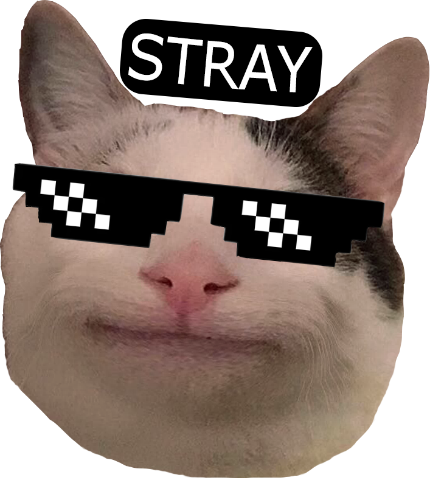

# STRAY 
***extending conversations, shrinking miscommunication.***

The go-to extension for every website, providing chat functionality to ensure privacy, facilitate engaging conversations, and beyond. 

### PROBLEM
Current chat systems suffer from several limitations: they lack domain-specific functionality, resulting in a disconnect between users and their intended audience.
User interaction is limited, hindering meaningful engagement beyond basic messaging, users have concerns regarding privacy; and many existing systems lack the engaging elements modern users seek, resulting in disinterest. Moreover, some websites don't even offer chat systems, further limiting user interaction and engagement possibilities.

### SOLUTION
We propose a comprehensive solution to address these challenges. Our extension empowers domain owners to create tailored chats, fostering community-building and collaboration. Enhanced user interaction features, such as message reactions, facilitate dynamic conversations. An efficient notification system ensures timely responses and reduces information overload. Privacy and security are prioritized through private chat functionalities. Additionally, we will integrate gamification elements to create an entertaining and interactive chat experience, captivating users and fostering deeper connections.

### ISSUES STRAY WILL SOLVE
:space_invader: ***Lack of Domain-specific Chat Functionality:*** Current chat systems often provide only global chat functionality, lacking the ability for domain owners to create official additional chats tailored to their specific audience or purpose.
 :crystal_ball: ***Domain-specific Chat Creation:*** We develop an extension where domain owners can easily create official additional chats specific to their domain, allowing them to curate discussions, events, or topics relevant to their audience.
 :space_invader:***Limited User Interaction and Engagement:*** Users often face challenges in engaging with chat content beyond basic messaging, such as reacting to messages, which limits their ability to express opinions and contribute meaningfully.
 :crystal_ball:***Enhanced User Interaction Features:*** Our solution includes features such as message reactions (upvote/downvote), empowering users to express opinions, acknowledge valuable contributions, and participate actively in discussions.
 :space_invader:***Inefficient Notification System:*** Existing chat systems may lack effective notification mechanisms, leading to missed messages or delays in responding to important communication.
 :crystal_ball:***Efficient Notification Mechanism:*** We implement a light notification system that changes the background color of messages to indicate pings or replies, ensuring users are promptly notified of important communication without overwhelming them with constant alerts.
 :space_invader:***Privacy Concerns in Communication:*** Users may desire more privacy in their chats, including the ability to have private conversations within the platform.
 :crystal_ball:***Privacy-focused Communication:*** Our solution offers private chat functionalities, enabling users to initiate confidential conversations with selected individuals, enhancing privacy and fostering trust among users.
 :space_invader:***Lack of Engaging Chat Experience:*** Many existing chat systems lack the interactive and gamified elements that appeal to modern users, resulting in a disconnect and disinterest among users who seek more engaging and entertaining communication platforms.
 :crystal_ball:***Creating an Entertaining and Interactive Chat Experience:*** Stray is to redefine online communication by seamlessly integrating interactive and gamified elements. We aim to provide users with a captivating and entertaining experience that fosters deeper connections and active engagement.

### FLOW
- **Open Extension:**
 - User opens the Stray Chat extension
 - The extension interface is displayed
- **Connect Wallet:**
 - Users are prompted to connect their wallet (e.g., MetaMask) to the extension
 - Upon connecting, the extension verifies wallet details and related accesses
- **User Interaction:**
  ***If the user is a regular user:***
 - They are directed to available chats within the domain they are browsing
 - They can view and participate in existing chats
 - They have the option to direct message specific users
  ***If the user is a domain owner:***
 - Join existing chats within their domain
 - Create new chats tailored to their audience
 - Delete or edit existing chats (excluding the global chat)
- **Direct Messaging:**
 - Users have the ability to initiate direct messages with specific users within the chat platform

 *This flow ensures a seamless experience for both regular users and domain owners, providing tailored features based on their roles within the extension.*

### ARCHITECTURE

### FUTURE DEVELOPMENTS
- **Incorporating Gamification and Interactivity:** we will develop a chat system that incorporates gamification features such as avatars, badges, and airdrops rewards.
- **Radio Function:** Adding a radio feature for users to listen to music or podcasts while chatting.
- **Mood-based Themes & Styles:**  Introducing customizable themes and styles based on users' moods, ensuring a personalized chat experience.
- **Fingerprint Login:** Enhancing security with fingerprint login authentication for seamless access.
- **Fund Transfer Capability:**  Enabling users to transfer funds directly within the chat interface, facilitating seamless transactions.

